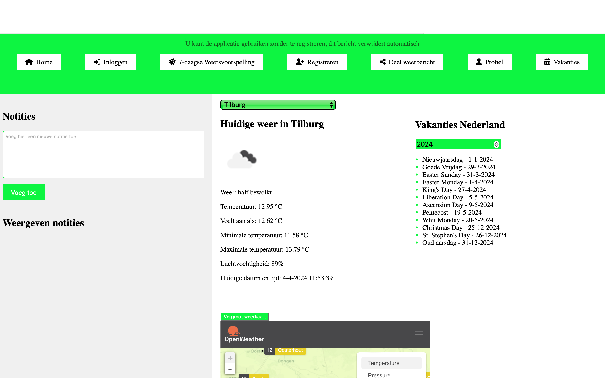
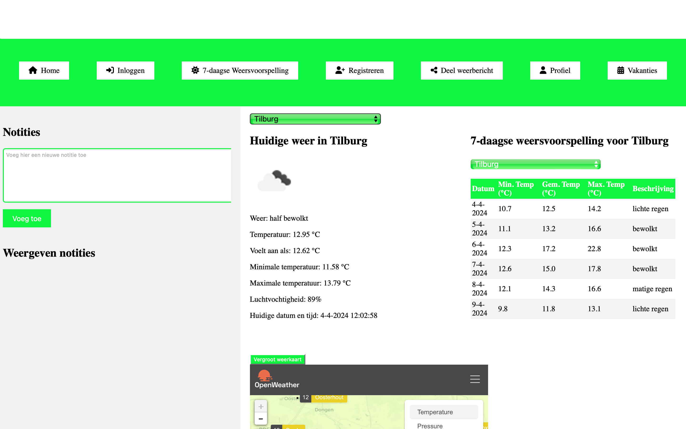
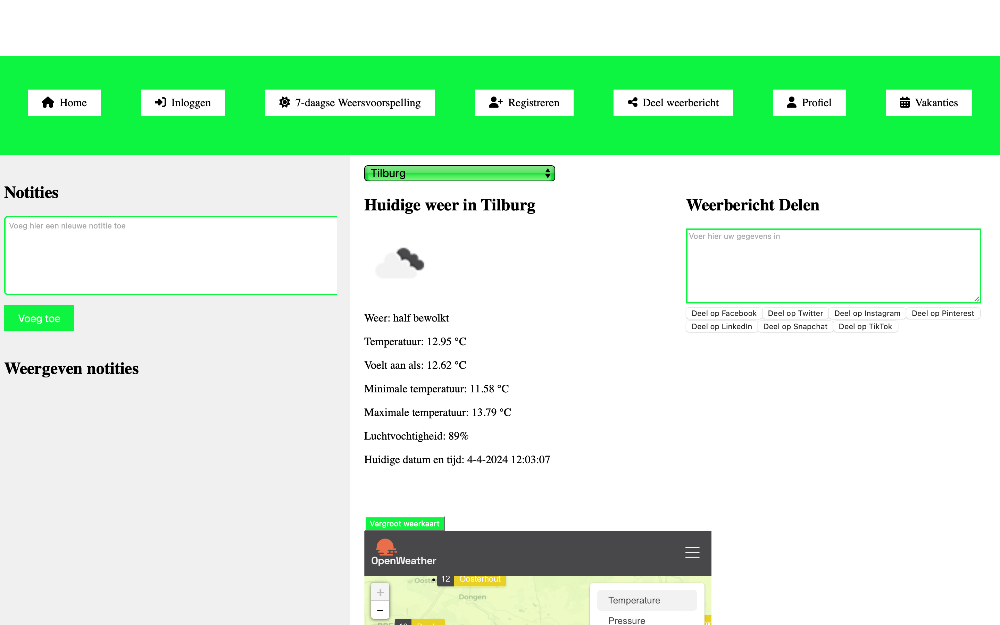
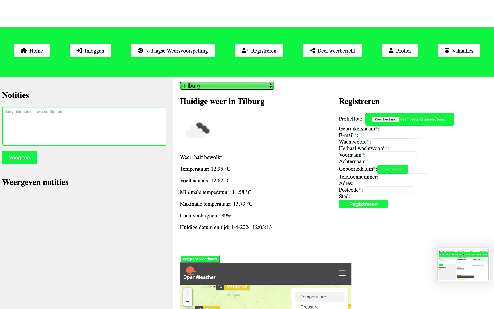
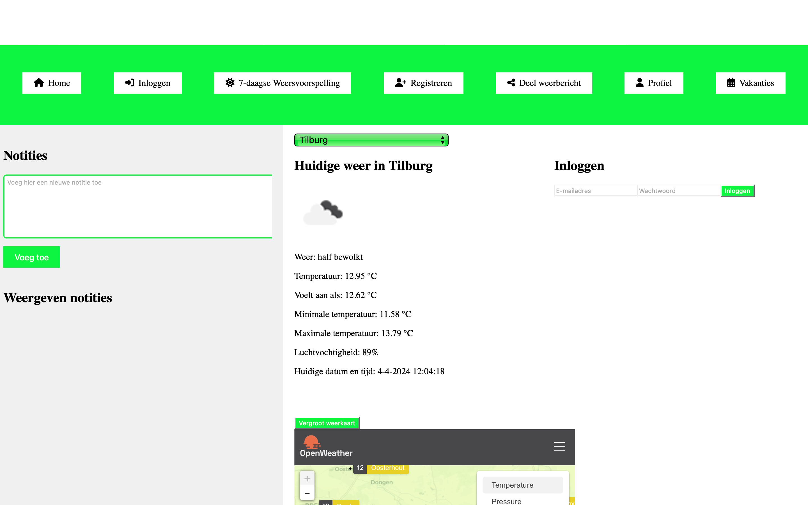
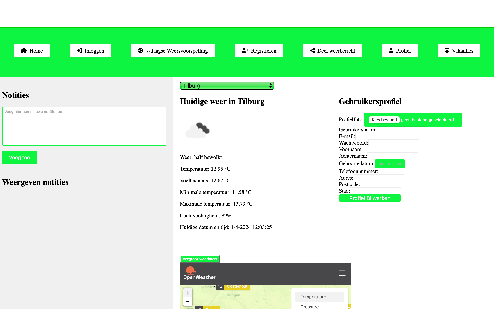

# Installatiehandleiding

## Inhoudsgave

- [Inleiding](#Inleiding)
- [Overzicht screenshots applicatie](#overzicht-screenshots-applicatie)
- [Informatie runtime environments](#informatie-runtime-environments)
- [Benodigheden](#benodigheden)
- [Stappenplan voor installatie](#stappenplan-voor-installatie)
- [Registreren en inloggen](#registreren-en-inloggen)
- [NPM commando's](#npm-commandos)
- [Link naar Github repository](#link-naar-github-repository)

## Inleiding
Welkom bij de installatiehandleiding van mijn weer-applicatie. Deze handleiding is bedoeld om 
begeleiding te bieden bij het installeren en configureren van de applicatie. Hierbij is geen 
voorkennis vereist.

De weer-applicatie is een webapplicatie voor het inwinnen van weersgegevens in veel Nederlandse 
steden en dorpen om zo een goede inschatting te kunnen maken wanneer het verstandig is om een 
bepaalde activiteit in te plannen met betrekking tot het weer. Daarbij zorgt de webapplicatie er 
ook voor dat je een overzicht krijgt van de Nederlandse feestdagen, zodat je hier als gebruiker 
ook rekening mee kan houden. De webapplicatie zorgt er ook voor dat je als gebruiker notities kan
maken wanneer je verschillende steden of dorpen wilt vergelijken op verschillende dagen. Wanneer 
je bijvoorbeeld wilt kijken welke vijf Brabantse dorpen en/of steden goed weer geven is het handig
om hiervan notities te maken als gebruiker. Dit zorgt voor meer overzicht voor jou als gebruiker. 
De webapplicatie kan zonder registratie gebruikt worden, maar als de gebruiker het meer persoonlijk
wil maken kan er een account aangemaakt worden. Doormiddel van deze installatiehandleiding kun je 
snel aan de slag met het opzetten van deze applicatie op jouw eigen computer.

Laten we aan de slag gaan!

## overzicht screenshots applicatie

Nu krijg je eerst een overzicht te zien van de belangrijkste screenshots van de applicatie, zodat 
je als gebruiker alvast een beeld krijgt hoe de web-applicatie eruit ziet.

Hier zie je de startpagina waarbij de vakantiedagen ook automatisch verschijnen.

Hier zie je de pagina met de 7-daagse weersvoorspelling.

Hier zie je de pagina waarbij je het weerbericht kan delen.

Hier zie je de pagina waarbij je kunt registreren.

Hier zie je de pagina waarbij je kunt inloggen.

Hier zie je de pagina waar je jouw profiel kunt bekijken en bewerken.

Natuurlijk kan je bij gebruik van de applicatie de lege vakken invullen naar eigen wens.

## Informatie runtime environments

### Frontend runtime environment: 
De plek waar je website draait als je hem bekijkt is belangrijk voor de voorkant van je 
applicatie, ook wel frontend genoemd. Deze is gemaakt in React. Dit is eigenlijk gewoon de 
webbrowser die je normaal gebruikt. Denk hierbij aan: Google Chrome, Mozilla Firefox, Safari of 
Microsoft Edge. Deze browsers berijpen de JavaScript-code van je website en laten daarbij ook de 
verschillende onderdelen van de React-applicatie zien.

### Backend runtime environment: 
Voor de achterkant van je applicatie, ook wel backend genoemd, 
is de runtime environment Node.js. De backend wordt trouwens ook gebouwd door Node.js. Node.js is 
een programma dat op een server draait en Node.js maakt het mogelijk om JavaScript code uit te 
voeren buiten de webbrowser. Hierdoor zou je JavaScript kunnen gebruiken voor bijvoorbeeld het 
verwerken van verzoeken die naar de server worden gestuurd, bestanden beheren en andere taken 
uitvoeren om ervoor e zorgen dat je applicatie gaat werken.  

## Benodigheden

- Editor of IDE: Gebruik een code-editor of een geïntegreerde ontwikkelomgeving (IDE) zoals 
Visual Studio Code, Atom, Sublime Text of WebStorm om je code te schrijven, bewerken en beheren.
- Webbrowser: Gebruik een moderne webbrowser zoals Google Chrome, Mozilla Firefox, Safari 
of Microsoft Edge om de applicatie te bekijken en te gebruiken.
- Node.js: Zorg ervoor dat Node.js is geïnstalleerd op je computer. Node.js is nodig voor het 
uitvoeren van JavaScript-code buiten de webbrowser. Hierbij gaat het eigenlijk om het opzetten 
van de backend van je applicatie.
- API-sleutel: Voor het ophalen van weerinformatie heeft de applicatie een API-sleutel nodig.
Gebruik de volgende API-sleutel: jouw-api-key.
- NPM of Yarn: Zorg ervoor dat je Node Package Manager (NPM) of Yarn hebt geïnstalleerd, 
afhankelijk van je voorkeur. Deze tools worden gebruikt om pakketten en afhankelijkheden voor 
je project te installeren, bij te werken en te beheren.
- Git: Installeer Git op je systeem als je versiebeheer wilt gebruiken voor het bijhouden van
wijzigingen in je code, als je wilt samenwerken met anderen en ook voor het beheren van je project 
op GitHub of een ander platform voor versiebeheer.

## Stappenplan voor installatie

Volg deze stappen om de weerapplicatie op te zetten en uit te voeren op je 
eigen computer:

1. Clone de repository: Gebruik Git om de repository te klonen naar je lokale machine. Open 
hiervoor je terminal en voer het volgende commando uit: 
git clone https://github.com/RVC2002/eindopdracht.
Dit commando zal een kopie van de repository op je computer maken, zodat je de applicatie lokaal 
kunt uitvoeren en bewerken.
2. Navigeer naar de projectmap: Ga naar de gekloonde repository in je terminal met het 
cd commando: cd eindopdracht.
Dit commando brengt je naar de directory waarin de code van de weerapplicatie is opgeslagen.
3. Installeer nu Node.js: Zorg ervoor dat Node.js is geïnstalleerd op je systeem. Je kunt Node.js 
downloaden en installeren vanaf de Node.js website (https://nodejs.org/en).
4. Installeer de benodigde pakketten: Gebruik npm of yarn om alle vereiste pakketten en
afhankelijkheden te installeren. Voer een van de volgende commando's uit in je temrinal: 
npm install of yarn install.
Een van deze commando's zal alle nodige bibliotheken en modules downloaden die de 
weerapplicatie nodig heeft om te kunnen draaien.
5. Stel de API-sleutel (https://openweathermap.org) in, zodat je automatisch weersgegevens krijgt van deze API. Via deze link kan je een eigen API key aanvragen. Bovenaan de pagina zie je een kopje met 'API' en vervolgens kan je dus de API key aanvragen. Open een nieuwe configuratiebestand, bijvoorbeeld config.js, 
en voeg de volgende regel toe met jouw API-sleutel: const apiKey = 'jouw-api-key'. Deze krijg je dus automatisch na het aanvragen van de API key via de website https://openweathermap.org. 
Deze API-sleutel is nodig om weerinformatie op te halen van externe bronnen.
6. Start de applicatie: Nadat alle pakketten zijn geïnstalleerd en de API-sleutel is ingesteld, 
kun je de applicatie starten. Voer daarvoor het volgende commando uit: npm start of yarn start.
Een van deze commando's zal een lokale ontwikkelingsserver opstarten en de weerapplicatie openen 
in je standaardwebbrowser.
7. Bekijk de applicatie: Open je webbrowser en ga naar http://localhost:3000 om de 
weerapplicatie te bekijken en te gebruiken.

Met deze stappen kan je snel en eenvoudig de weerapplicatie opzetten en uitvoeren 
op je eigen computer. Pas de stappen indien nodig aan op basis van bepaalde vereisten van jouw 
project.

## Registreren en inloggen
Indien er al accounts beschikbaar zijn kan je inloggen met de gegevens die je krijgt van de NOVI 
Backend applicatie. Je kunt ook zelf registreren en inloggen in de weer-applicatie. Dit kun je doen
door de volgende stappen te volgen:
1. Registreren: Om een account aan te maken, ga je naar de registratiepagina van de weerapplicatie. 
Je kunt de registratiepagina  vinden door te klikken op de "Registreren" knop op de startpagina 
van de applicatie.
2. Vul het registratieformulier in: Op de registratiepagina word je gevraagd om een 
profielfoto, gebruikersnaam, e-mailadres, wachtwoord, herhaal wachtwoord, voornaam, achternaam, 
geboortedatum, telefoonnummer, adres, postcode en stad in te voeren. Vul alle vereiste velden in 
en zorg ervoor dat je een sterk en uniek wachtwoord kiest. Als de ingevoerde gegevens niet aan de
vereisten voldoen krijg je hier automatisch een melding van.
3. Inloggen: Zodra je account is aangemaakt, kun je inloggen op de weerapplicatie met de door jou
gekozen gebruikersnaam en wachtwoord. Ga naar de inlogpagina, voer je inloggegevens in en klik op
de "Inloggen" knop om de applicatie ingelogd te gebruiken.
4. profiel: Nadat je bent ingelogd kan je je ingevulde gegevens terugzien op de profielpagina. 
Je kunt hier je gegevens behouden, bewerken en verwijderen. Ga naar de profielpagina, kijk wat je
eventueel wilt veranderen of verwijderen en klik op de "bijwerken" knop op de gewijzigde gegevens
op te slaan in de applicatie.

Wanneer je de weer-applicatie opnieuw opstart kan je je eigen inloggegevens gebruiken. Het is ook 
mogelijk om helemaal niet te registreren of in te loggen, omdat de weer-applicatie ook werkt zonder dit.
   
## Npm commando’s
- **npm run start:** 
Dit commando start de ontwikkelingsserver. Dit zorgt ervoor dat je applicatie 
lokaal draait op een server en opent het in je webbrowser. Als je wijzigingen maakt in de code,
zal de server deze automatisch oppikken en de applicatie opnieuw laden in de browser. 
Dit maakt het gemakkelijk om je applicatie te ontwikkelen en direct wijzigingen te zien zonder 
handmatig te hoeven vernieuwen.
- **npm run build**
Dit commando bouwt de productieversie van je applicatie. Dit betekent dat het 
alle nodige bestanden optimaliseert en samenvoegt. Hierdoor is de applicatie klaar  om te worden
geüpload naar een webserver. Het resultaat is een set van bestanden die klaar zijn om te worden 
gebruikt door je website, inclusief HTML, CSS en JavaScript, die niet veranderen tijdens het 
gebruik van de website.
- **npm run test**
Dit commando voert de tests uit die zijn geschreven voor je applicatie. Het zoekt
naar alle testbestanden in je project en voert ze uit met behulp van een testframework zoals Jest.
Dit helpt bij het controleren of je code correct werkt en of er geen fouten zijn opgetreden
tijdens het ontwikkelproces.
- **npm run eject**
Dit commando wordt gebruikt om de standaardconfiguratie van Create React App 
te vervangen door een meer geavanceerde configuratie. Hierdoor krijg je volledige controle over 
de instellingen van je project. Het wordt meestal gebruikt wanneer je meer geavanceerde opties 
nodig hebt die niet beschikbaar zijn in de standaardconfiguratie van Create React App.

Deze npm commando's kan je invoeren in de terminal voor eventueel gebruik. 

## Link naar Github repository
https://github.com/RickvanCampen/Eindopracht_Frontend_Improved

